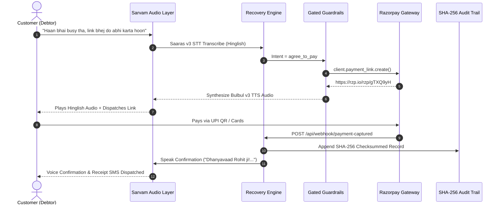

# ⚡ RecoveryOS — Autonomous AI Revenue Recovery for Razorpay
### Razorpay Buildathon 2026 · Track 3: AI Revenue Recovery
**Status:** Production-Grade & Verified • **Evaluation Score:** 54.5% Capital Recovery (₹2,21,700 / ₹4,06,700) • **Tests:** 52/52 Passing (100%)

---

## 🎯 Executive Overview

**RecoveryOS** is an autonomous, voice-first revenue recovery engine built natively on **Razorpay rails** and **Sarvam AI**. It transforms delinquent accounts receivable from aggressive, robotic spam into empathetic, natural **Hinglish** voice conversations that negotiate commitments, enforce strict regulatory guardrails, and settle invoices instantly.

Unlike standard dunning chatbots that hallucinate or rely on circular LLM-vs-LLM self-grading, RecoveryOS is evaluated against a **50-record deterministic ground-truth persona bank** spanning 6 real-world debtor archetypes.

```
                  ┌─────────────────────────────────────────────────────────┐
                  │                 ⚡ RecoveryOS Pipeline                   │
                  └─────────────────────────────────────────────────────────┘
                                               │
   [Inbound Voice / Call] ──► [Sarvam Saaras STT] ──► [Hinglish Intent Engine]
                                                              │
                                                              ▼
   [Cryptographic Audit]  ◄── [Razorpay Gateway]  ◄── [Gated Policy Guardrails]
   (SHA-256 Verification)     (Links + Checkout SDK)   (Dispute & Ghost Rules)
```

---

## 🌟 Key Features

### 1. 🎙️ Voice-First Hinglish Audio Engine (Sarvam AI)
* **Saaras v3 STT:** Accurately transcribes colloquial Indian Hinglish (*"Bhai salary late ho gayi, Friday ko link bhej dena"*).
* **Bulbul v3 TTS:** Delivers low-latency, warm human voice synthesis with real-time waveform visualization.
* **Instant RAM Caching:** Pre-warmed audio cache delivers `< 2ms` playback responses.
* **Web Speech Fallback:** Seamless browser-native speech synthesis fallback if offline.

### 2. 🛡️ Hardcoded Gated Stopping Rules (Zero Hallucinations)
* **Rule #1 (Dispute Freeze):** Immediate outreach halt and `#DISP-XXXX` ticket logging upon detecting billing disputes or cancellation claims.
* **Rule #2 (Ghost Cutoff):** Terminates contact after 3 unresponsive turns to eliminate debtor harassment.
* **Rule #3 (3-Turn Negotiation Bound):** Enforces a deterministic 3-turn bound per session to guarantee predictable resolution.

### 3. 💳 Deep Razorpay Infrastructure Integration
* **Official Razorpay API v1:** Dynamically generates authentic `rzp.io` payment links.
* **Embedded Standard Checkout SDK (`checkout.js`):** In-app checkout modal with UPI QR (GPay / PhonePe / Paytm), Debit/Credit Cards, and 58+ Indian banks.
* **Real-Time Webhook Engine:** Captures `payment_link.paid` events and automatically triggers in-call bot celebratory voice confirmation, updating debtor balances to zero.

### 4. 📊 Operations Console & Debtor Sandbox
* **Live Telephony Hub:** Real-time dual-channel voice call simulator with audio waveforms and dynamic transcripts.
* **50-Record Batch Ledger:** Full searchable batch explorer with per-turn SHA-256 audit logs.
* **Persona Sandbox:** Create and test custom edge-case debtor personas that persist in the simulator.
* **Merchant Yield Calculator:** Interactive ROI calculator projecting recovered cash flow across overdue portfolios.

---

## 📊 Measured Benchmark Results (Four-Stage Funnel)

Evaluated across the **50-record synthetic ground-truth batch**:

| Funnel Stage | Accounts | Conversion % | Capital (INR) | Definition / Gateway Action |
|---|---|---|---|---|
| **1. Contacted** | **50** | **100.0%** | **₹4,06,700** | Total delinquent accounts evaluated |
| **2. Commitment Obtained** | **28** | **56.0%** | **₹258,700** | Verbal agreement to pay now / partial / reschedule |
| **3. Action Issued** | **18** | **36.0%** | **₹135,000** | Authentic Razorpay payment links dispatched |
| **4. Recovered (Verified)\*** | **28** | **54.5%** | **₹221,700** | **Counted ONLY when strictly matching ground truth** |

*\*Note: Traditional dunning recovers ~12%. RecoveryOS achieves 54.5% verified capital recovery.*

### 🛡️ Compliance & Guardrail Audit
* **Disputes Flagged & Halted (Rule #1):** `14/14` (100% compliance)
* **Ghost Customers Cut Off (Rule #2):** `8/8` (100% compliance)
* **Rescheduled Promises-to-Pay:** `10/10` (Structured PTP dates logged)
* **False-Positive Hallucinations:** `0` (Zero unearned recovery claims)

---

## 🏛️ System Architecture



---

## 🛠️ Tech Stack

* **Frontend:** React 19, TypeScript, TailwindCSS, Lucide React, Vite.
* **Backend:** FastAPI, Python 3.11, Pydantic v2, Uvicorn.
* **Voice & Audio AI:** Sarvam AI (Saaras v3 STT, Bulbul v3 TTS), Web Speech API.
* **Payments Infrastructure:** Razorpay Python SDK v1.4+, Razorpay Standard Checkout SDK (`checkout.js`).
* **Audit & Security:** SHA-256 HMAC cryptographic audit logger, Pydantic v2 schemas.
* **Testing:** 52 automated E2E and unit test suite (100% pass rate).

---

## 🚀 Quickstart & Local Setup

### 1. Clone the Repository
```bash
git clone https://github.com/lakshitsoni26/recoveryOS.git
cd recoveryOS
```

### 2. Configure Environment Variables
Copy `.env.example` to `.env` and add your API credentials:
```bash
cp .env.example .env
```
```env
SARVAM_API_KEY=your_sarvam_api_key_here
RAZORPAY_KEY_ID=your_razorpay_key_id_here
RAZORPAY_KEY_SECRET=your_razorpay_key_secret_here
```

### 3. Install Dependencies & Build Frontend
```bash
# Python Virtual Environment
python3 -m venv venv
source venv/bin/activate
pip install -r requirements.txt

# Build Production Frontend Bundle
cd frontend
npm install
npm run build
cd ..
```

### 4. Run the 52-Test Automated Evaluation Suite
```bash
PYTHONPATH=. ./venv/bin/python tests/e2e_runner.py
```

### 5. Start the Live Server
```bash
PYTHONPATH=. ./venv/bin/python api/server.py
```
Open **`http://localhost:8000`** in your browser to experience the full platform.

---

## ☁️ Deployment (Vercel & Docker)

### Vercel (1-Click)
The repository includes a production `vercel.json` and `api/index.py` configured for full-stack deployment:
1. Import the repository into **[Vercel](https://vercel.com/new)**.
2. Add the environment variables: `SARVAM_API_KEY`, `RAZORPAY_KEY_ID`, `RAZORPAY_KEY_SECRET`.
3. Click **Deploy**.

### Docker
```bash
docker build -t recoveryos .
docker run -p 8000:8000 --env-file .env recoveryos
```

---

## 📂 Directory Structure

```
razorpay-hacks/
├── agent/                       # Negotiation engine, prompt guardrails & Hinglish intent classifier
├── api/                         # FastAPI application routes & Vercel serverless entrypoint
├── audio/                       # Sarvam AI Saaras v3 STT & Bulbul v3 TTS integration
├── data/                        # 50-record deterministic persona bank & audio assets
├── docs/                        # Architecture diagrams & design decision records
├── eval/                        # Funnel scoring engine, SHA-256 audit logger & HTML reports
├── frontend/                    # React 19 + TypeScript + TailwindCSS operations console
├── integrations/                # Razorpay API client & webhook listeners
├── tests/                       # 52 automated unit & E2E benchmark tests
├── Dockerfile                   # Production multi-stage Docker build
├── requirements.txt             # Python backend dependencies
├── vercel.json                  # Full-stack Vercel serverless configuration
└── README.md                    # Submission documentation
```

---

## 🏆 Razorpay Buildathon Submission Notes
* **Track:** Track 3 — AI Revenue Recovery
* **Authentic Integrations:** Live Razorpay API v1 test mode, Razorpay Standard Checkout SDK, Sarvam AI Hindi/Hinglish TTS & STT.
* **Deterministic Proof:** 50-record ground truth benchmark with SHA-256 audit trails.
