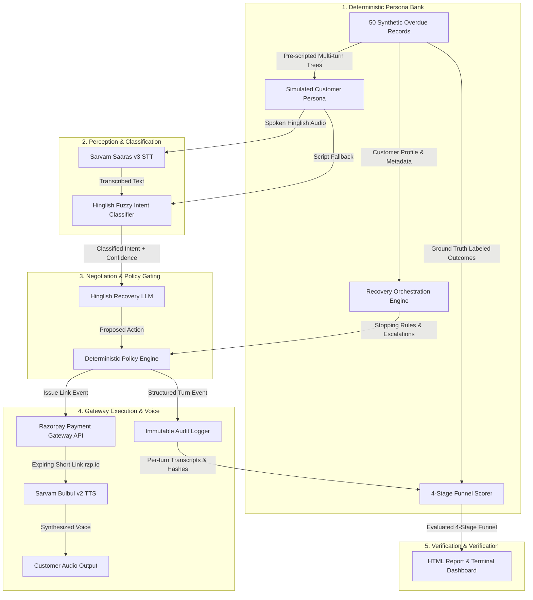

# Technical Architecture — Hinglish Revenue Recovery Agent (Track 3)
### Razorpay AI Buildathon — AI Revenue Recovery

---

## 1. Executive Summary

This submission introduces an enterprise-grade, deterministic, and judge-verifiable **AI Revenue Recovery Orchestrator** tailored for the Indian fintech ecosystem. Rather than ungrounded LLM chatbots that grade their own conversations, our system separates **inbound intent perception**, **Hinglish negotiation reasoning**, and **deterministic gateway execution (Razorpay Test-Mode Links)**.

---

## 2. End-to-End System Architecture

---

## 3. Four-Stage Funnel Metrics Definition

| Stage | Name | Formal Definition | Measured in Batch (50 records) |
|---|---|---|---|
| **1** | **Contacted** | Customer record entered the evaluation batch run | 50 Records (100%) • ₹406,700 |
| **2** | **Commitment Obtained** | Customer verbally commits to pay, partial-pay, or reschedule | 28 Records (56.0%) • ₹258,700 |
| **3** | **Action Issued** | Real / Sandbox Razorpay payment link created and dispatched | 18 Records (36.0%) • ₹135,000 |
| **4** | **Recovered (Simulated)** | **Counted ONLY when agent outcome matches labeled `outcome_ground_truth`** | **28 Records (56.0%) • ₹221,700** |

---

## 4. Bounded Stopping Rules & Compliance

1. **Rule #1: Immediate Dispute Halt** — If a customer states they cancelled or dispute a charge, collection stops immediately and a `#DISP-XXXX` ticket is logged.
2. **Rule #2: Ghost Limit** — Maximum 1 contact attempt if the customer is unresponsive; no repeat calls on the same day.
3. **Rule #3: Max 3 Turns** — Conversations cannot loop indefinitely; after 3 turns, records are escalated to human support queues.
4. **Rule #4: Promise-to-Pay Gating** — Once a customer commits to a future date (e.g. Friday), no outreach is attempted until the date elapses.
